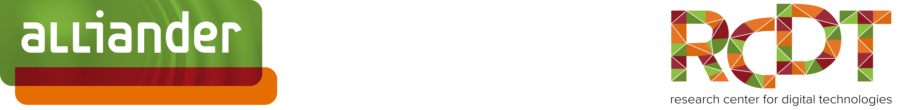
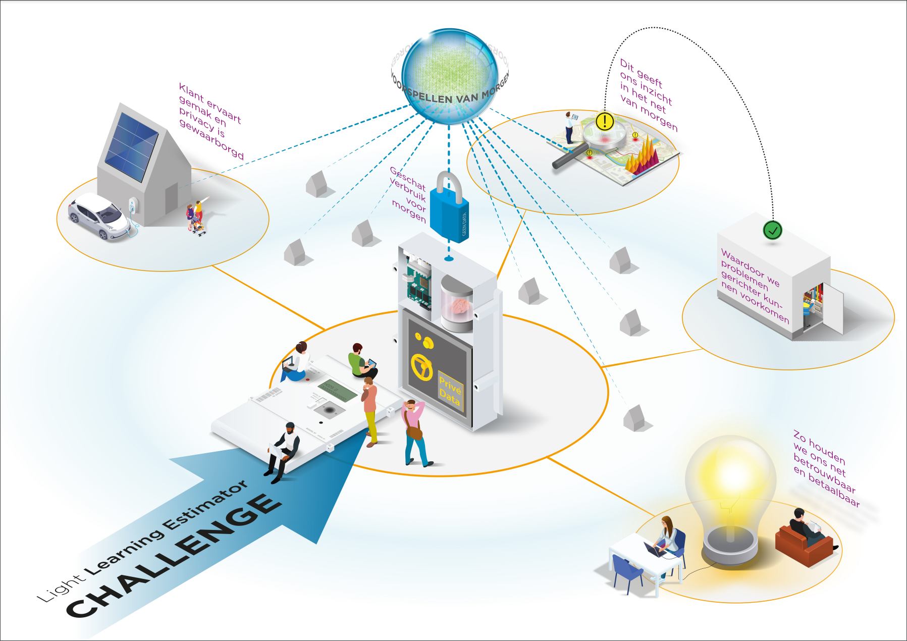

# Light EDGE Learning Estimator challenge

**Alliander geeft vorm aan de energietoekomst van Nederland** 

Wij staan voor een energievoorziening die iedereen onder gelijke condities toegang geeft tot betrouwbare, betaalbare en duurzame energie. Dat is waar wij iedere dag aan werken. Door ons netwerk continu te verbeteren bereiden we ons voor op de toekomst. Een toekomst waarin iedereen duurzame energie kan gebruiken, produceren en delen. 

Alliander ontwikkelt en beheert energienetten. Via onze kabels en leidingen ontvangen ruim drie miljoen Nederlandse huishoudens en bedrijven elektriciteit, gas en warmte. We beheren meer dan 90.000 km elektriciteitsnet en 40.000 km gasnet en zijn er trots op dat onze netten tot één van de betrouwbaarste ter wereld behoren. Onze 7000 collega’s zorgen ervoor dat het licht brandt, de huizen warm zijn en de bedrijven draaien. Dit doen we vanuit het maatschappelijk belang om energie voor iedereen betrouwbaar, betaalbaar en bereikbaar te houden. 

Deze opdracht is opgesteld door het research center en draagt direct bij aan de betrouwbaarheid van ons energie net. Het Research Center for Digital Technologies geeft vorm aan het digitale netwerkbedrijf van de toekomst. Via deze challenge onderzoeken we hoe we met kleine voorspellingen, namelijk die van de individuele huishoudens, bij elkaar opgeteld een betere prognose kunnen maken voor het verbruik van morgen. Met een betere voorspelling zijn wij beter in staat in te spelen op eventuele problemen. Jij draagt via deze challenge dus direct bij aan de energie transitie! 

**De Light Learning Estimator** 

De Light Learning Estimator **(LLE)** maakt periodiek een voorspelling en voor ieder individueel huishouden. Deze huishoudens geven cumulatief inzicht in eventuele problemen op wijkniveau. Deze software moet gaan werken op light weight hardware, voor onze test een Raspberry Pi 4. De software geeft twee keer per dag een prognose af van jouw energieverbruik en energie opwek. Wanneer er iets in jou gebruik veranderd, door bijvoorbeeld de aanschaf zonnepanelen of een laadpaal aan huis, dan stelt de estimator zich binnen enkele dagen bij en wordt de voorspelling weer accuraat.  

De LLE is een continuous learning, voorspellend algoritme dat draait op lichte hardware dat zich bevindt aan de uiteinden van het netwerk. De voordelen voor gebruikers en Alliander/Liander op een rijtje: 

Voordelen Alliander: 

- Beter inzicht in verwacht energieverbruik van huishoudens, en dus wijk en het elektriciteitsnet 

- En daarmee het beter kunnen verhelpen van storingen 

Voordelen voor gebruikers: 

- Privacy-gevoelige data blijft binnen de slimme meter van het huishouden 

In deze challenge gaan jullie aan de slag om dit stukje software te ontwikkelen. Hier staat natuurlijk ook iets tegenover: 
**Naast eeuwige roem, is de hoofdprijs €1.000,-. De deadline voor inzenden is 6 februari 2022, 23:59.**

Verdere instructies voor de challenge zijn [hier](LLEProtocol.pdf) te vinden vanaf vrijdag 17 december. Bij onduidelijkheden, zoek vooral contact.

**Veel plezier!** 

N.B. 
1. Schrijf je [HIER](https://docs.google.com/forms/d/1KAlcNgMeU62mEw3YGnrdtdb8G_-K46DM0Ep_UzFGNNk/) in voor de challenge. 
2. Nadat je je hebt ingeschreven, krijg je een toegang tot een NDA en verwerkersovereenkomst. Om met echte data te werken, dienen deze ondertekend te worden.
3. Nadat deze ondertekend zijn, krijg je van ons toegang tot de data en verdere instructies, en kan je aan de slag.

Contact:
Leon de Jong 
